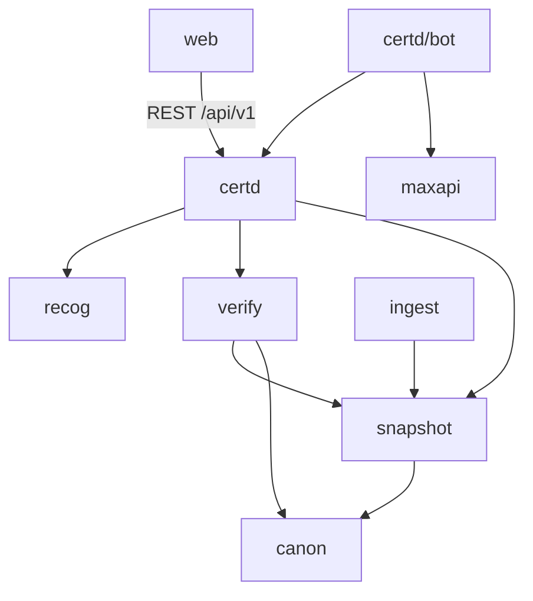

# CLAUDE.md — карта проекта «Сертконтроль» для ИИ-агентов

Сертконтроль — бот и мини-приложение MAX для проверки и мониторинга сертификатов и деклараций о соответствии.
Модульный монолит на C++20 (`certd` + `ingest`), PostgreSQL 16, мини-приложение на React + TS.

**Текущий этап: 0 — каркас (завершён, ожидает команды на этап 1).** План и статус — [`docs/plan.md`](docs/plan.md).

Источники истины (читать перед любой работой):
- [`docs/ARCHITECTURE.md`](docs/ARCHITECTURE.md) — АРХ: стек, структура, контракты C1–C9, алгоритмы, CI;
- [`docs/CASE_REQUIREMENTS.md`](docs/CASE_REQUIREMENTS.md) — КЕЙС: ограничения и формат сдачи. **При конфликте КЕЙС важнее**;
- [`docs/adr/`](docs/adr/README.md) — принятые отклонения и уточнения АРХ.

---

## Модули и роли

| Модуль | Роль | Назначение | Статус | README |
|---|---|---|---|---|
| `libs/contracts` | все | Контракты C1, C2, C4, C5 + fake | этап 0 ✔ | [→](libs/contracts/README.md) |
| `libs/canon` | R2 | Канонизация и грамматика номера (C1) | этап 1 | [→](libs/canon/README.md) |
| `libs/snapshot` | R1 | Формат, writer, reader, diff (C2) | этап 1–2 | [→](libs/snapshot/README.md) |
| `libs/verify` | R2 | Поиск, правила вердикта (C4) | этап 1, 3 | [→](libs/verify/README.md) |
| `libs/recog` | R3 | PDF, QR, OCR (C5) | этап 1, 4 | [→](libs/recog/README.md) |
| `libs/maxapi` | R4 | Bot API MAX, outbox-отправитель, initData | этап 1–2 | [→](libs/maxapi/README.md) |
| `apps/ingest` | R1 | Сборка снапшотов, diff, NOTIFY; C3 | этап 0 (CLI) | [→](apps/ingest/README.md) |
| `apps/certd` | R3 | Домен (C6), REST, задачи, `/healthz`, статика | этап 0 (health) | [→](apps/certd/README.md) |
| `apps/certd/bot` | R4 | Диалоги бота | этап 1 | [→](apps/certd/bot/README.md) |
| `web/` | R4 | Мини-приложение | этап 0 (каркас) | [→](web/README.md) |
| `db/` | R3 (C8 — R1) | Миграции PostgreSQL, мигратор | этап 0 ✔ | [→](db/README.md) |
| `data/demo/` | R1 | Демо-источники N и N+1 | этап 1 | [→](data/demo/README.md) |
| `tests/`, `fuzz/`, `bench/` | все | Тесты, fuzz (этап 3), бенчмарки (этап 3) | — | [→](tests/README.md) |

Роли (АРХ §1): R1 «Данные реестра», R2 «Поиск и вердикт», R3 «Backend и распознавание», R4 «MAX и продукт».

## Граф зависимостей и запреты импорта

Стрелка — «использует». Зависимости только сверху вниз, циклов нет (АРХ §5).

Все C++-модули дополнительно используют `libs/contracts` — лист графа, только стандартная библиотека.

Запреты (проверяются `scripts/ci/deps-check.sh` в CI):
- `libs/contracts` — только стандартная библиотека;
- `libs/{canon,snapshot,verify,recog}` не включают Drogon и ничего из `apps/`;
- `canon` не знает о `snapshot`/`verify`; `snapshot` — о `verify`/`recog`; `verify` — о `recog`/`maxapi`;
- `apps/ingest` не зависит от `apps/certd`;
- `apps/certd/bot` трогает домен только через `DomainService` (C6);
- `web/` не импортирует ничего вне `web/src` и `package.json`.

## Команды

Все проверки — скрипты `scripts/ci/*.sh`; CI вызывает их же. Локально без установленных пакетов — через dev-контейнер
(`ubuntu:24.04` + все apt-зависимости): `scripts/dev.sh <команда>`.

| Что | Команда |
|---|---|
| Сборка + тесты GCC 13 Release (тесты ×2) | `scripts/dev.sh scripts/ci/cpp-build-test.sh gcc-release` |
| Сборка + тесты clang 18 ASan/UBSan | `scripts/dev.sh scripts/ci/cpp-build-test.sh clang-asan` |
| Покрытие C++ (gcovr, ≥ 70% строк libs/ + apps/) | `scripts/dev.sh scripts/ci/cpp-coverage.sh` → `build/coverage/report/index.html` |
| clang-format (проверка / исправление) | `scripts/dev.sh scripts/ci/cpp-format-check.sh [--fix]` |
| clang-tidy | `scripts/dev.sh scripts/ci/cpp-tidy.sh` |
| Запреты импорта | `scripts/ci/deps-check.sh` |
| Миграции на чистом PG 16 | `scripts/ci/db-migrations.sh` |
| Web: lint, tsc, тесты ≥ 70% (×2), build | `docker run --rm -u "$(id -u):$(id -g)" -e HOME=/tmp -v "$PWD:/src" -w /src node:24-slim scripts/ci/web.sh` |
| `docker build --no-cache` с таймером ≤ 240 с | `scripts/ci/docker-build.sh` |
| Стек одной командой + `/healthz` | `scripts/ci/compose-smoke.sh` |
| Секреты | `scripts/dev.sh scripts/ci/gitleaks.sh` |
| Запуск стека | `docker compose up --build` → http://localhost:8080/healthz |

Пресеты CMake — `CMakePresets.json`: `gcc-release`, `clang-asan`, `coverage`, `tidy`, `docker`. Сборка — в `build/<пресет>`.

## Правила изменения контрактов

Контракты: C1, C2, C4, C5 — `libs/contracts/include/sertkontrol_contracts.hpp`; C3 — `apps/ingest/source_adapter.hpp`;
C6 — `apps/certd/domain.hpp`; C7 — `openapi.yaml` (этап 1); C8, C9 — `db/migrations/*.sql` и `docs/contracts/outgoing_message.schema.json`.

Изменение контракта = одновременно в одном коммите:
1. правка файла контракта и всех его реализаций, включая fake;
2. обновлённые golden-файлы и тесты;
3. строка в [`docs/changelog-contracts.md`](docs/changelog-contracts.md);
4. синхронные правки связанных перечислений: `sk::ErrorCode` ↔ `web/src/api/problem.ts` `ProblemCode`; `snapshot::Status` ↔ CHECK `portfolio_item.last_status`.

## Куда добавлять

| Что | Куда | Обязательно |
|---|---|---|
| Правило вердикта | `docs/rules.md` → `libs/verify` → `tests/verify/rules_test` | Основание: факт / расчёт / рекомендация |
| Источник реестра | Класс, удовлетворяющий `SourceAdapter` (C3), в `apps/ingest` | `static_assert`, тест на фикстуре |
| Экран мини-приложения | `web/src/screens.ts` + `web/src/screens/<Имя>.tsx` | Состояния через `StateView`, тест |
| Эндпоинт | `openapi.yaml` → `DomainService` (если новая операция) → тонкий обработчик в `apps/certd` | Фильтр по `user_id`, RFC 9457, контрактный тест |
| Таблица / колонка | Новый `db/migrations/NNNN_*.sql` | Не править применённые миграции |
| Отклонение от АРХ | `docs/adr/NNNN-*.md` по шаблону | До кода |

---

## Общие правила (действуют на всех этапах)

- Работаем строго по этапам (docs/plan.md): только то, что входит в этап; этап закрывается воротами-проверкой, коммитом и отчётом; следующий этап — только по команде. Заглушка будущего — fake из контракта с пометкой в docs/plan.md.
- Структура, стек, контракты, инварианты АРХ §7 и безопасность АРХ §10 — строго по АРХ. Отклонение — только через ADR в `docs/adr/`. Изменение контракта — только с записью в `docs/changelog-contracts.md`.
- C++-зависимости — только из apt Ubuntu 24.04 (списки `docker/apt-*.txt` — единый источник для Dockerfile, CI и dev-образа).
- MAX API: сверяться с актуальной официальной документацией MAX, ничего не выдумывать. Непроверяемое — за интерфейсом, с фикстурами, в «известных ограничениях» README.
- Данные ФСА не подтверждены → работаем на демо-данных; они явно помечены как тестовые в интерфейсе и README (КЕЙС §2 п.10).
- Никаких секретов в репозитории: только `.env.example` с пустыми значениями. gitleaks в CI.
- Коммиты — небольшие, Conventional Commits (`feat(certd): …`, `fix(web): …`, `docs: …`, `build: …`, `ci: …`, `test: …`). **Без соавторства**: никаких `Co-Authored-By`, «Generated with …» и упоминаний ИИ в коммитах и PR. Автор — текущий `git user`.
- Нельзя отключать предупреждения, правила линтеров или тесты ради зелёного статуса. Если без этого никак — ADR с обоснованием (пример — [ADR-0010](docs/adr/0010-explicit-member-initializers.md)). `NOLINT` — только точечно и с причиной в той же строке.

## Стиль кода

- C++20, GCC 13 и clang 18, `-Wall -Wextra -Wpedantic -Werror` + `-Wshadow -Wconversion -Wsign-conversion -Wold-style-cast` и др. (`cmake/Warnings.cmake`). `.clang-format` (Google, 110 колонок), `.clang-tidy` (все проверки — ошибки).
- Ошибки домена — `sk::Result<T>` / `sk::Error`, не исключения. Исключения — только для ошибок программиста.
- Корутины (`drogon::Task`): параметры по значению; не лямбды с захватом.
- Поля агрегатов — с инициализатором по умолчанию (`{}`).
- Публичный API — doxygen (`///`) в C++, JSDoc (`/** */`) в TS. Комментарии объясняют «почему» со ссылкой на АРХ §… или ADR.
- TS: `strict` + `noUncheckedIndexedAccess` + `exactOptionalPropertyTypes`; ESLint `strictTypeChecked`, 0 предупреждений.

## Документация (обновляется в каждом этапе)

Пишется в первую очередь для других ИИ-агентов. `CLAUDE.md` — карта; `README.md` в каждом модуле по единому шаблону:
назначение и границы (что делает и чего НЕ делает) · ключевые файлы · публичный интерфейс и контракты · зависимости в обе стороны ·
потоки данных (A и B из АРХ §4) · инварианты и «почему так» · тесты и запуск · ограничения и отложенное.
Документация соответствует коду на момент каждого коммита.

## Ворота-проверка

Выполняется в конце КАЖДОГО этапа; любой красный пункт — исправить и пройти заново.

1. Чистый клон → сборка GCC и clang с `-Werror`: 0 ошибок, 0 предупреждений. clang-tidy, eslint, tsc strict — чисто.
2. Все тесты зелёные, прогон дважды, флаки нет. ASan/UBSan без находок (с этапа 3 — и TSan).
3. Покрытие ≥ 70% строк отдельно для C++ (gcovr: libs/ и apps/, без tests/fuzz/bench) и web (Vitest). Порог зашит в CI.
4. Все шаги CI проходят; локально — теми же скриптами `scripts/ci/*.sh`.
5. `docker build --no-cache` ≤ 4 мин; `docker compose up` поднимает стек одной командой, `/healthz` → 200.
6. Критерии приёмки F-требований этапа (АРХ §2) проверены тестами.
7. Код соответствует АРХ, циклов зависимостей нет (`deps-check.sh`).
8. README модулей, CLAUDE.md и docs/plan.md обновлены и совпадают с кодом.
9. gitleaks чисто; в `git log` нет соавторства и упоминаний ИИ.
