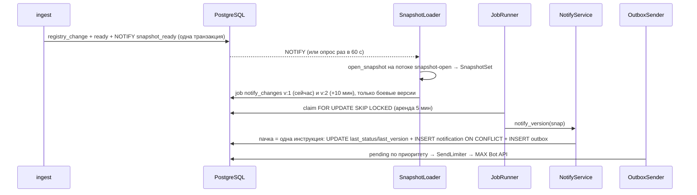

# apps/certd — сервер: домен, REST, webhook, бот, outbox, мини-приложение (владелец R3; bot/ — R4)

**Статус:** этап 2 — поток B целиком: `LISTEN snapshot_ready` + страховочный опрос, набор снапшотов (боевой, демо N,
демо N+1), очередь задач в PostgreSQL, `notify_changes(v)`, отправитель outbox с двухуровневым token bucket, демо-сценарий
(«Симулировать обновление», «Сбросить демо»), история документа, «Указать поставщика» в боте, очистка по срокам хранения.
Этап 1 — `DomainServiceImpl`, REST `/api/v1`, webhook MAX, бот, `/healthz`, раздача мини-приложения.

## Назначение и границы
- Делает: поток A целиком (АРХ §4): webhook → бот → `DomainService` → распознавание (пул) → вердикт → outbox → MAX;
  поток B, шаги 3–5 (АРХ §4): `NOTIFY snapshot_ready` → загрузка версии → задача `notify_changes(v)` → outbox →
  отправитель с лимитером → MAX; REST для мини-приложения; демо-сценарий F6.
- НЕ делает: сборку снапшота и diff (`apps/ingest`), правила вердикта (`libs/verify`), транспорт и лимиты MAX
  (`libs/maxapi`), текст уведомления (`bot/card.cpp` — инъекция `NoticeRenderer` из `main.cpp`).

## Ключевые файлы
| Файл | Что внутри |
|---|---|
| `domain.hpp` | **C6** `DomainService` и DTO (`UserContext{max_user_id, channel}`, `CheckResult`, `PortfolioItem`, `Page`, `DataStatus`, `DocumentHistory`, `DemoUpdate`, …) |
| `domain_service.hpp/.cpp` | `DomainServiceImpl`: пользователи, согласие, журнал `check_log` с пачками, портфель, ИНН, `attach_supplier`, `history`, `simulate_update`, `reset_demo`; все запросы с фильтром по `user_id` |
| `fake_domain.hpp/.cpp` | `FakeDomainService` — C6 в памяти для тестов бота и REST (в т. ч. демо N → N+1) |
| `rest_api.hpp/.cpp` | `/api/v1/*`: аутентификация (initData или dev-пользователь, ADR-0013), проверка согласия (`authorize`), строгие параметры запроса, тонкие обработчики, RFC 9457; `Allow` на 405 (`install_allow_header`) |
| `json_views.hpp/.cpp` | JSON по `openapi.yaml`, коды ошибок → HTTP |
| `webhook.hpp/.cpp` | `POST /max/webhook`: секрет → разбор → `inbound_update` → 200 → обработка в фоне |
| `bot/` | Диалоги бота — [README](bot/README.md) |
| `ports.hpp`, `pg_ports.*`, `memory_ports.hpp` | Порты `Outbox` (C9), `InboundLog`, `DialogStore` (TTL 30 мин); реализации на PostgreSQL и в памяти; `OutboxSender` (лимитер, джиттер, отсрочка чата) |
| `snapshot_set.hpp` | `SnapshotSet`: три роли (`kProd`, `kDemoBase`, `kDemoUpdated`) с атомарной заменой; `for_user` выбирает снапшот по демо-стадии |
| `snapshot_loader.*` | Последняя `ready`-версия каждой роли → `SnapshotSet`; `mmap` и проверка CRC — на отдельном потоке |
| `jobs.*` | `JobQueue` (C8 `job`: аренда `FOR UPDATE SKIP LOCKED`, backoff, 5 попыток) и `JobRunner` (диспетчер по `kind`) |
| `notify.*` | `NotifyService`: `notify_version(v)` для боевых портфелей, `notify_user` для демо; `ChangeNotice` — вход рендера |
| `maintenance.*` | Виды задач, ключи дедупликации `v:<версия>:<проход>`, очистка по срокам хранения (АРХ §10) |
| `recognition_pool.*` | Пул потоков распознавания с ограниченной очередью (ADR-0004) |
| `rate_limiter.*` | 30 проверок в минуту на пользователя (АРХ §10) |
| `media.*`, `clock.hpp` | Тип файла по сигнатуре; «сегодня» по Москве |
| `csv_import.*` | `parse_import_csv`: CSV «SKU; номер; ИНН» (`;`/`,`, RFC 4180, BOM, заголовок), лимиты 1 МБ и 1000 строк; без Drogon — его гоняет `fuzz_import_csv` |
| `import_report.*` | Отчёт импорта из результатов постановки строк (общий для домена и фейка) |
| `registry_link.*` | `number_by_registry_link`: номер записи по ссылке реестра из QR (F10); `check_text` проверяет ссылку раньше номеров |
| `bot_identity.*` | `resolve_bot_username`: username бота для `web_app` из `GET /me`; неверный `web_app` MAX отвергает всё сообщение (HTTP 404 `Link not found`) |
| `config.*`, `health.*`, `main.cpp` | Конфигурация из окружения, `/healthz`, сборка компонентов, `LISTEN`, таймеры фоновых циклов |

## Переменные окружения
`CERTD_PORT` (8080), `CERTD_THREADS` (0), `CERTD_DB_CONNECTIONS` (4), `POSTGRES_HOST/PORT/DB/USER/PASSWORD`,
`SNAPSHOT_DIR`, `WEB_ROOT`, `MAX_BOT_TOKEN` (пусто — бот выключен), `MAX_WEBHOOK_SECRET` (обязателен с токеном,
`[A-Za-z0-9_-]{5,256}`), `MAX_BOT_USERNAME` (запасной username для кнопок `open_app`; основной — из `GET /me`, `bot_identity.hpp`), `MAX_API_BASE_URL`
(`https://platform-api2.max.ru`), `CERTD_DEV_USER_ID` (только без токена, ADR-0013), `CERTD_RECOG_THREADS` (2),
`CERTD_RECOG_QUEUE` (8).

## HTTP
| Путь | Ответ |
|---|---|
| `GET /healthz` | 200, если БД доступна и снапшот загружен; иначе 503 |
| `/api/v1/*` | по [`openapi.yaml`](../../openapi.yaml) (C7); история и демо-действия — [ADR-0014](../../docs/adr/0014-history-and-demo-endpoints.md) |
| `POST /api/v1/me/consent` | 204 — согласие записано; до него операции с данными отвечают `403 consent_required`, доступны только `/me` и `/data-status` (АРХ §10) |
| чужой метод на `/api/v1/*` | 405 с `Allow` (RFC 9110 §15.5.6); на `/portfolio/{id}` — явным обработчиком (`kExplicit405Path`), т. к. Drogon 1.8.7 отвечает там 404 |
| `POST /max/webhook` | 401 — неверный секрет; 400 — не событие; 200 — принято или повтор |
| `/` | статика `web/dist` |

## Куда добавлять эндпоинт
1. `openapi.yaml` (C7) + запись в docs/changelog-contracts.md.
2. Новая доменная операция — метод `DomainService` (C6) в `domain.hpp`, реализации в `domain_service.cpp` и `fake_domain.cpp`.
3. Тонкий обработчик в `rest_api.cpp` + маршрут в `register_routes`.
4. Тесты: `tests/certd/rest_api_test.cpp` (на фейке), `pg_test.cpp` (на БД); `openapi_test` проверит, что путь описан.

## Поток B в certd (АРХ §4)

- Демо (F6): `simulate_update` переводит `app_user.demo_stage` 0 → 1 и синхронно вызывает `notify_user` против
  демо-снапшота N+1; `reset_demo` возвращает статусы портфеля к N, удаляет уведомления версии N+1 и стадию 0.
- Второй проход `notify_changes` через 10 минут подбирает документы, добавленные в портфель, пока шла сборка.
- Циклы (`main.cpp`): задачи — раз в 1 с по 10, outbox — раз в 0,3 с по 20 сообщений, снапшоты — `LISTEN` + опрос
  раз в 60 с, очистка — задача `cleanup` раз в сутки.

## Зависимости
- Зависит от: `sk::contracts`, `sk::canon`, `sk::snapshot`, `sk::verify`, `sk::recog`, `sk::maxapi`, Drogon 1.8.7, PostgreSQL 16.
- От него зависят: `web/` (REST).

## Инварианты и «почему так»
- Пользователь — только из проверенной initData или события webhook; каждый SQL-запрос фильтрует по его `user_id`;
  чужая запись неотличима от несуществующей (404) — АРХ §10.
- Только параметризованные запросы (`$1`); в выражениях с `$n` и литералами — явные приведения (`$6::bigint`),
  иначе libpq передаёт неверный двоичный формат.
- Снапшот берётся из `SnapshotSet` один раз на запрос (АРХ §7.4); демо-пользователь видит N или N+1 по своей
  `demo_stage`, боевой — только боевой снапшот (демо не подменяет боевые данные).
- Ровно одно уведомление на (документ, версия): `UNIQUE (portfolio_item_id, version, kind)` в `notification`,
  условие `last_version < v` и одна SQL-инструкция на пачку — повтор задачи после падения ничего не дублирует (АРХ §7.5).
- Уведомление сравнивает `portfolio_item.last_status` со снапшотом, а не только `registry_change`: так закрыта гонка
  «документ добавлен во время сборки», а пропущенные версии сворачиваются в одно сообщение.
- Лимиты MAX (30 запр/с, 2 сообщ/с в чат) не превышаются ни в одном окне: глобально C = 5, r = 25/с, на чат C = 1,
  r = 1/с, в окне τ ≤ C + r·τ вызовов (АРХ §7.6, `libs/maxapi` `SendLimiter`); нет токена чата — откладываются все
  сообщения этого чата без траты попыток; 429 обнуляет глобальное ведро.
- Webhook отвечает до обработки: MAX ждёт 200 не дольше 30 с и повторяет до 10 раз; повтор отсекается по `inbound_update`.
- Параметры корутин — по значению; никакого `?:` рядом с `co_await` (CLAUDE.md).
- Файлы пользователей не пишутся на диск (временный каталог Drogon — в `/tmp`).
- Параметр запроса вне C7 или пустой (`?cursor=`) — 400, а не «без фильтра»: опечатка в фильтре иначе вернула бы
  весь портфель (находки schemathesis, `scripts/ci/contract-test.sh`).
- Если QR выписки содержит ссылку на реестр, она заменяет ссылку, построенную по `registry_id`.

## Тесты
`tests/certd/`: `certd_test` (конфиг, health, фейк домена, REST, бот, webhook, компоненты), `certd_pg_test`
(домен, IDOR, outbox и лимитер, диалоги, загрузчик снапшотов, очередь задач, `notify_changes` с «падением» между
пачками, демо N → N+1 и сброс, история, очистка — на PostgreSQL через `scripts/ci/with-pg.sh`), `certd_jury_test`
(сценарий жюри целиком: webhook → PDF → «На контроль» → «Симулировать обновление» → ровно одно уведомление через
отправитель), `openapi_test` (пути `openapi.yaml` ≡ маршруты). `main.cpp` проверяется `scripts/ci/compose-smoke.sh`.
Контрактные тесты C7 на живом стеке в боевом режиме — `scripts/ci/contract-test.sh` (schemathesis 4.28.0, все
проверки, кроме `unsupported_method`, заменённой собственной проверкой 405 + `Allow` — ADR-0016).

## Ограничения и отложенное
- Отправитель outbox — один на процесс (последовательный): при нескольких репликах certd лимиты MAX делятся между
  ними неявно; общий лимитер — этап 3, если понадобится.
- Разбор PDF — в процессе certd, без подпроцесса с `RLIMIT_*` (Should, АРХ §10).
- Импорт CSV (F9) — этап 4.
- `TRACE` получает 405 без `Allow`: Drogon 1.8.7 отвечает до маршрутизации и советов ([ADR-0016](../../docs/adr/0016-trace-405-without-allow.md)).
