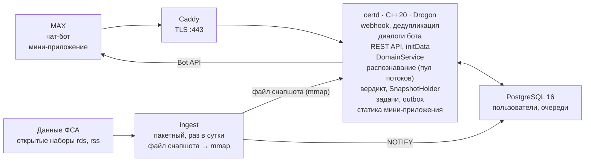
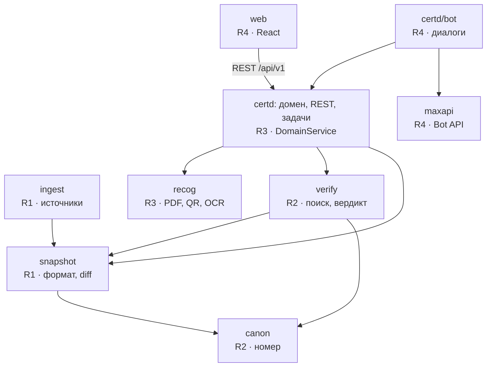

# Сертконтроль: архитектура, стек и ТЗ команды


## 1. Решение

Сертконтроль — модульный монолит на C++20 из двух процессов:

- **`certd`** обслуживает бота, REST API мини-приложения, распознавание и вердикт;
- **`ingest`** раз в сутки собирает неизменяемый бинарный снапшот реестра, считает diff и отдаёт снапшот `certd` через `mmap`.

Пользовательские данные, задачи и очередь сообщений хранятся в PostgreSQL 16. Мини-приложение на React раздаёт тот же `certd`.

**Главный незакрытый риск — не технический.** Свежесть и формат открытых наборов ФСА всё ещё не проверены. Архитектура изолирует источник за адаптером (R1), но если набор обновляется реже раза в неделю, мониторинг (F5) теряет смысл. Это первая задача R1 в спринте 0.

### Что уже измерено

Спайк на Ubuntu 24.04, 2 vCPU, на выписке 89369/26.

| Показатель | Значение | Вывод |
|---|---|---|
| Установка всех C++-зависимостей из apt | ≈ 30 с | Собственный базовый образ не нужен, лимит сборки 5 минут с запасом |
| Сборка спайка: Drogon (корутины) + poppler + zxing-cpp + Tesseract | 5,7 с | Стек совместим и линкуется |
| Текстовый слой выписки, 3 страницы | 5–6 мс | Выписки разбираем без OCR |
| QR: рендер страницы 150 dpi + zxing-cpp | 31–34 мс | QR — первый и самый надёжный путь |
| OCR страницы 300 dpi, rus+eng | 7,5 с; номер прочитан с тремя ошибками: `ЕАЭС М RU Д-СВ.РАО8.В.89369/26` | OCR — только запасной путь с сообщением «распознаю»; нечёткий поиск обязателен |

Контракты между ролями лежат в файлах `sertkontrol_contracts.hpp` и `domain.hpp` (C6), в папке «хакатон». Оба компилируются GCC 13 с `-Wall -Wextra -Wpedantic -Werror` и clang 18. Код спайка — в подпапке `spike_recog`.

### Роли

| Роль | Зона | Главный артефакт | Трудоёмкость, чел.-дни |
|---|---|---|---|
| R1 «Данные реестра» | Источники, формат снапшота, diff, демо-данные, CI и Docker-сборка | `ingest`, `libs/snapshot` | ≈ 12,5 (+1 Could) |
| R2 «Поиск и вердикт» | Канонизация, индексы, нечёткий поиск, правила вердикта, граф риска | `libs/canon`, `libs/verify` | ≈ 12 (+1,5 Could) |
| R3 «Backend и распознавание» | `certd`, PostgreSQL, REST API, распознавание, задачи и уведомления | `apps/certd`, `libs/recog`, `openapi.yaml` | ≈ 13,5 (+1 Should) |
| R4 «MAX и продукт» | Клиент Bot API, диалоги, мини-приложение, деплой, README, демо | `libs/maxapi`, `web/` | ≈ 13,5 |

---

## 2. Требования

Основной сценарий для жюри:

1. переслать боту выписку;
2. получить вердикт;
3. поставить документ на контроль;
4. нажать «Симулировать обновление»;
5. получить уведомление.

Всё из блока Must должно работать и в мобильном, и в веб-клиенте MAX (ограничение 3 кейса).

### Функциональные

| ID | Требование | MoSCoW | Владелец | Критерий приёмки |
|---|---|---|---|---|
| F1 | Проверка по номеру, введённому текстом (любая раскладка, до 20 номеров в сообщении) | Must | R2, R4 | Номер с 1–2 ошибками находится; ответ ≤ 1 с |
| F2 | Проверка PDF: QR → текстовый слой | Must | R3 | Выписка 89369/26 даёт верный номер и ссылку на реестр |
| F3 | Карточка вердикта: статус, сроки, заявитель, изготовитель, продукция, ссылка на реестр, дата данных. Каждая строка помечена «факт / расчёт / рекомендация» | Must | R2, R4 | Все поля и метки основания на месте. Если не найдено — «нет в данных на <дату>» и ближайшие номера |
| F4 | Портфель: поставить на контроль, список с фильтрами, удалить | Must | R3, R4 | Доступен из бота и из мини-приложения |
| F5 | Ежедневное обновление → diff → уведомление владельцу портфеля | Must | R1, R3, R4 | Смена статуса наблюдаемого документа → ровно одно сообщение ≤ 15 мин после готовности снапшота |
| F6 | Демо-режим: пара снапшотов N и N+1, кнопка «симулировать обновление», всё помечено как тестовое | Must | R1, R4 | Проверяющий проходит сценарий одним аккаунтом за 5 минут |
| F7 | Фото и сканы: OCR с подтверждением при низкой уверенности | Should | R3 | Фото выписки → верный номер сразу или после вопроса «это номер …?» |
| F8 | Сверка «заявитель = поставщик» по ИНН | Should | R2, R3 | Несовпадение → предупреждение с объяснением |
| F9 | Импорт CSV «SKU, номер, ИНН поставщика» | Should | R3, R4 | 500 строк ≤ 10 с, отчёт по ненайденным |
| F10 | Сканирование QR камерой в мини-приложении (`openCodeReader`) — платформенный бонус | Should | R4 | Работает на телефоне. На вебе метод не поддержан — кнопка скрыта, работает загрузка файла (F2) |
| F11 | Граф риска: лаборатория лишена аккредитации → предупреждение по всем её документам в портфеле | Could | R1, R2 | Если в наборах есть номер аттестата и есть открытый реестр аккредитованных лиц |
| F12 | Расчётное правило «документ по требованиям до 2025 года теряет силу с 01.09.2026» | Could | R2 | Если признак редакции требований есть в записи |

**Won't:**

- API маркетплейсов и Росаккредитации;
- парсинг pub.fsa.gov.ru;
- юридические заключения;
- реестры других стран ЕАЭС;
- оплата;
- несколько экземпляров `certd`.

### Нефункциональные

Нагрузка пилота ничтожна: десятки пользователей × десятки проверок в день. Масштаб задают размер реестра N и секунды CPU на OCR, а не RPS.

| Показатель | Цель | Как мерить |
|---|---|---|
| Ответ на номер текстом (webhook → отправка) | p95 ≤ 1 с | `check_log.latency_ms` |
| Ответ на PDF / фото | p95 ≤ 3 с / ≤ 10 с (цель после оптимизации OCR — ≤ 3 с) | То же, с разбивкой по этапам |
| Webhook: ответ 200 | ≤ 100 мс (MAX требует ≤ 30 с) | Метрика обработчика |
| Поиск в снапшоте (точный / нечёткий) | p99 ≤ 1 мс / ≤ 5 мс | Google Benchmark на полном снапшоте |
| Ingest полного набора | ≤ 15 мин, пиковая RSS ≤ 2 ГБ | `/usr/bin/time -v` |
| Замена снапшота | Без простоя, 0 ошибок при нагрузке во время swap | Нагрузочный тест + TSan |
| Исходящие вызовы MAX | ≤ 25 запр/с и ≤ 1 сообщ/с в чат (лимиты MAX — 30 и 2) | Счётчик ответов 429 = 0 |
| `docker build --no-cache` | ≤ 4 мин (лимит кейса — 5) | Таймер в CI |
| Перезапуск `certd` до готовности | ≤ 5 с (за счёт mmap, а не ingest) | `/healthz` |

---

## 3. Компоненты и развёртывание

Четыре контейнера в одном `compose.yaml`: `certd`, `ingest`, `postgres` и `caddy`. Caddy запускается только в профиле `prod` для TLS на VPS; локально жюри он не нужен.

Два процесса C++ и одна база: `certd` отвечает на запросы, `ingest` готовит данные.



Как компоненты связаны между собой:

- MAX ходит в `certd` через Caddy: webhook и запросы мини-приложения.
- `certd` ходит в MAX напрямую через Bot API.
- `ingest` не разговаривает с `certd` по сети. Он кладёт файл в общий том и сообщает о нём через `NOTIFY` в PostgreSQL.

| Сервис | Образ | Порты | Тома | Healthcheck | Владелец |
|---|---|---|---|---|---|
| `certd` | multi-stage: сборка на `ubuntu:24.04` + apt, рантайм `ubuntu:24.04` только с `.so`; отдельная стадия `node:20` собирает мини-приложение | 8080 | `snapshots:/data/snapshots:ro` | `GET /healthz`: снапшот загружен, БД доступна | R3 |
| `ingest` | Тот же сборочный образ, другая точка входа | — | `snapshots:/data/snapshots` (rw), `sources:/data/sources` | Возраст последнего успешного запуска < 26 ч | R1 |
| `postgres` | `postgres:16` | 5432 (только внутри сети compose) | `pgdata` | `pg_isready` | R3 |
| `caddy` (профиль `prod`) | `caddy:2` | 443, 80 | `caddy_data` | — | R4 |

Режимы `ingest`:

| Режим | Что делает |
|---|---|
| `--daemon` | Запуск ежедневно в 04:00 МСК |
| `--once` | Ручной запуск: `docker compose run --rm ingest --once` |
| `--demo` | Собрать демо-пару N/N+1 из `data/demo` |

`certd` работает в единственном экземпляре: рейт-лимитер и пул распознавания живут в памяти процесса. Горизонтальное масштабирование потребует вынести лимитер в PostgreSQL — это первое, что пересмотреть при росте.

### Структура репозитория

Владелец указан в скобках.

```
libs/canon/        канонизация и грамматика номера (R2)
libs/snapshot/     формат, writer, reader, diff (R1)
libs/verify/       индексы, нечёткий поиск, правила, граф риска (R2)
libs/recog/        PDF, QR, OCR, пул задач (R3)
libs/maxapi/       клиент Bot API, outbox-отправитель, initData (R4)
apps/ingest/       источники, планировщик, запись событий (R1)
apps/certd/        DomainService, REST, задачи (R3) + bot/ (R4)
web/               мини-приложение React + TypeScript (R4)
db/migrations/     SQL-миграции (R3)
data/demo/         демо-источники N и N+1 (R1)
tests/ fuzz/ bench/   у каждого — свои подкаталоги
docker/  compose.yaml  .env.example  openapi.yaml  README.md
```

---

## 4. Потоки

### Поток A — проверка документа

Описан для PDF в чате. Текст и фото идут тем же путём, без лишних шагов.

1. MAX → `POST /max/webhook`. `certd` сравнивает `X-Max-Bot-Api-Secret` за константное время. Затем строит ключ дедупликации: `m:<mid>` для сообщения, `c:<callback_id>` для кнопки. Затем делает `INSERT … ON CONFLICT DO NOTHING`. Повтор сразу получает 200; новое событие уходит во внутреннюю очередь и тоже получает 200. (R4)
2. Обработчик бота определяет тип события, ставит в outbox «Проверяю…» с приоритетом и вызывает `DomainService::check_file`. (R4 → R3)
3. `certd` скачивает вложение по `payload.url` (≤ 20 МБ) и отдаёт его в пул распознавания. Порядок: QR (страницы с конца) → текстовый слой → OCR первой страницы. Распознавание идёт в отдельном пуле потоков, IO-потоки Drogon ждут результат через `co_await`. (R3)
4. Каждый найденный номер проверяется через `verify::check(snapshot, query)` под `shared_ptr`, взятым из `SnapshotHolder` один раз на запрос. (R2)
5. `Verdict` превращается в карточку и кнопки → outbox → отправитель → MAX; пишется строка в `check_log`. (R4, R3)
6. Если уверенность OCR низкая или расстояние до ближайшего номера ненулевое, бот спрашивает: «Это номер …? [Да] [Ввести вручную]».

| Этап потока A | Бюджет | Измерено в спайке |
|---|---|---|
| Webhook → ответ 200 | ≤ 100 мс | — |
| Скачивание вложения из MAX | ≤ 500 мс | не мерили |
| QR (рендер 150 dpi + zxing-cpp) | ≤ 100 мс | 31–34 мс |
| Текстовый слой PDF | ≤ 50 мс | 5–6 мс |
| OCR одной страницы (только если нет QR и текста) | ≤ 3 с цель, ≤ 10 с допустимо | 7,5 с (300 dpi, rus+eng) |
| Канонизация + поиск + вердикт | ≤ 10 мс | — |
| Отправка ответа в MAX | ≤ 300 мс | — |

### Поток B — ежедневное обновление

1. В 04:00 МСК `ingest` скачивает набор с `If-None-Match` / `If-Modified-Since`; если набор не изменился — выход. Затем разбирает его потоком и нормализует через `canon::canonicalize` от R2. Затем сортирует по ключу, пишет `snap-<v>.bin.tmp`, делает `fsync` и `rename`. (R1)
2. Считает diff с предыдущим снапшотом. В `registry_change` пишутся только наблюдаемые ключи (их тысячи, а не миллионы), по остальным — агрегаты по переходам статусов. Затем `INSERT snapshot_version` и `NOTIFY snapshot_ready, '<v>'`. (R1)
3. `certd` по `LISTEN` открывает файл, проверяет заголовок и делает `SnapshotHolder::set`. Старый снапшот освобождается, когда его отпустит последний читатель. (R3, R2)
4. Задача `notify_changes(v)`: `INSERT INTO notification … SELECT … JOIN portfolio_item … ON CONFLICT DO NOTHING` → строки outbox.
   - Изменившиеся документы задача находит сравнением `last_status` с новым снапшотом, а не только по `registry_change`. Поэтому документ, добавленный во время сборки снапшота, не теряется (подробно — в ТЗ R3).
   - Повторный запуск не дублирует уведомления. (R3)
5. Отправитель outbox работает с двухуровневым token bucket: 25 запр/с всего, 1 сообщ/с в чат. На 429 и 5xx — экспоненциальный повтор с джиттером. (R4)

**Отказы потока B:**

- не скачалось — старый снапшот остаётся, в карточках и `/data-status` виден возраст данных;
- отвергнуто больше 5% записей — сборка прерывается (quality gate), старый снапшот остаётся;
- упал `certd` — после рестарта берёт последнюю версию со статусом `ready` и догоняет неотправленные уведомления.

**Демо-вариант потока B:**

- В `certd` открыты оба демо-снапшота, N и N+1. Какой из них видит пользователь, решает его `demo_stage`.
- Кнопка «Симулировать обновление» переводит пользователя на N+1 и запускает `notify_changes` только для него.
- «Сбросить демо» возвращает пользователя к N.
- Уведомление приходит за секунды, боевые данные не затрагиваются. Несколько членов жюри могут проходить сценарий одновременно и повторять его.

---

## 5. Модули, владельцы и контракты

У каждого модуля один владелец. Зависимости идут сверху вниз, без циклов.

Единственное пересечение ролей в коде — `canon`: R1 вызывает его при сборке снапшота, R2 — при поиске. Поэтому `canon` первым получает golden-тесты и версию `canon::kVersion`.

Схема «модули и владельцы»: 9 модулей, 4 роли. Стрелка означает «использует».



`certd/bot` живёт в бинаре `certd`, но принадлежит R4 и трогает домен только через `DomainService`. Мини-приложение ходит в тот же `DomainService` через REST. Поэтому бот и мини-приложение всегда показывают одинаковый вердикт.

| # | Контракт | От → кому | Форма | Заморозка |
|---|---|---|---|---|
| C1 | `canon::canonicalize`, `parse`, `key_hash` | R2 → R1, R3 | `sertkontrol_contracts.hpp` + `tests/canon_golden.tsv` | Сигнатуры — день 1, golden — день 3 |
| C2 | `Snapshot`, `RecordView`, `open_snapshot` | R1 → R2, R3 | То же + `docs/snapshot-format.md` | API — день 1, формат — день 5 |
| C3 | `SourceAdapter`, `RawRecord` | внутри R1 | concept | День 2, после спайка набора |
| C4 | `verify::check`, `Verdict`, `Finding` | R2 → R3, R4 | `sertkontrol_contracts.hpp` + `docs/rules.md` (каталог правил) | День 1 |
| C5 | `recog::recognize`, `Found` | R3 → R3 (домен) | То же | День 2 |
| C6 | `DomainService` (корутины `drogon::Task<>`) | R3 → R4 | `apps/certd/domain.hpp` | День 3 |
| C7 | REST `/api/v1` | R3 → R4 (web) | `openapi.yaml` + контрактные тесты | День 4 |
| C8 | `snapshot_version`, `registry_change`, `NOTIFY snapshot_ready` | R1 → R3 | SQL-миграция | День 3 |
| C9 | outbox (JSON `OutgoingMessage`) | R3 → R4 | SQL + JSON-схема | День 3 |

**Правило изменения контракта:**

- PR с аппрувом обоих владельцев;
- обновлённые golden-файлы;
- запись в `docs/changelog-contracts.md`.

До готовности реализации каждый поставщик контракта отдаёт fake (например, `FakeSnapshot` из трёх записей), чтобы потребители не ждали.

---

## 6. Данные

### Снапшот

Снапшот — неизменяемый файл, который `certd` отображает в память целиком.

- Порядок байтов — little-endian.
- Секции выровнены на 64 байта.
- Запись уложена ровно в одну cache line.

| Секция | Тип | Байт на запись | Назначение |
|---|---|---|---|
| Заголовок | 256 байт на файл | — | magic `SKSNAP01`, версия формата, `canon::kVersion`, источник, `source_date`, N, таблица секций (offset, size), XXH3 полезной нагрузки |
| `keys` | `uint64_t[N]`, по возрастанию | 8 | XXH3 канонического номера: двоичный поиск и merge-join для diff |
| `records` | `PackedRecord[N]`, `sizeof == 64` | 64 | Статус, вид, флаги, 4 даты (`int32` дней от эпохи), ИНН, ссылки на строки, страна, ТН ВЭД, лаборатория, `registry_id` |
| `serial_index` | `(uint64 serial·yy, uint32 idx)`, по возрастанию | 12 | Кандидаты для нечёткого поиска |
| `lab_index` | CSR: `offsets[L+1]`, `docs[N]` | ≈ 4 | Граф риска «лаборатория → документы» |
| `strings` | `offsets[M]` + UTF-8 | ≈ 28 на номер + имена | Номера уникальны; наименования заявителей и изготовителей интернированы |
| `products` | ссылки в `strings` | ≤ 128 (обрезка по границе UTF-8) | Холодная часть: читается только для карточки |

**Почему запись — массив структур (AoS), а ключи — отдельно:**

- Точечный запрос трогает одну cache line записи, а не десяток колонок.
- Двоичный поиск идёт по плотному массиву `keys`: в одной строке кэша помещается 8 ключей.
- Diff читает оба массива последовательно, и на нём работает аппаратный prefetch.

**Оценка объёма.** Считается по раскладке. N неизвестно до спайка набора; `registry_id = 21 950 326` из выписки даёт только верхний ориентир.

$$
M_{\text{hot}} \approx N\,(8 + 64 + 12 + 4 + 28) + S_{\text{names}} = 116\,N + S_{\text{names}},\qquad M_{\text{cold}} \le 128\,N
$$

| N записей | Горячая часть (без имён) | Холодная часть | Двоичный поиск, шагов |
|---|---|---|---|
| 5·10⁶ | ≈ 580 МБ | ≤ 640 МБ | 23 |
| 2·10⁷ | ≈ 2,3 ГБ | ≤ 2,6 ГБ | 25 |

Резидентно в памяти только то, что трогали. Точечный запрос — это ≈ 16 страниц `keys` и одна страница `records`: последние 9 шагов из 25 укладываются в одну страницу на 512 ключей.

Пиковая память `ingest` не растёт как N·sizeof(запись). Записи пишутся во временный файл, а сортируется только перестановка `(key, idx)` — 12 байт на запись, то есть 240 МБ при N = 2·10⁷.

### PostgreSQL

В PostgreSQL — только изменяемые данные; реестр туда не грузим.

| Таблица | Ключевые поля | Ограничения и индексы | Пишет |
|---|---|---|---|
| `app_user` | `id`, `max_user_id`, `consent_at`, `is_demo`, `demo_stage` | `UNIQUE(max_user_id)` | R3 |
| `supplier` | `id`, `user_id`, `inn`, `name` | `UNIQUE(user_id, inn)`; CHECK контрольных цифр ИНН — в коде | R3 |
| `portfolio_item` | `id`, `user_id`, `doc_key`, `doc_kind`, `sku`, `supplier_id`, `last_status`, `last_version` | `UNIQUE(user_id, doc_key, sku) NULLS NOT DISTINCT`, индекс `(doc_key)` | R3 |
| `snapshot_version` | `version`, `source`, `source_date`, `file_path`, `record_count`, `status`, `stats`, `is_demo` | `status IN ('building','ready','failed')` | R1 |
| `registry_change` | `version`, `doc_key`, `before`, `after`, `status_date` | `PRIMARY KEY(version, doc_key)` | R1 |
| `notification` | `id`, `portfolio_item_id`, `version`, `kind` | `UNIQUE(portfolio_item_id, version, kind)` — идемпотентный fan-out | R3 |
| `inbound_update` | `dedup_key`, `received_at`, `processed_at`, `error` | `PRIMARY KEY(dedup_key)` | R4 |
| `outbox` | `id`, `user_id`, `payload`, `priority`, `not_before`, `attempts`, `status` | индекс `(status, priority, not_before)` | R3 пишет, R4 отправляет |
| `job` | `id`, `kind`, `dedup_key`, `run_at`, `payload`, `locked_until`, `attempts` | выборка `FOR UPDATE SKIP LOCKED` | R3 |
| `dialog_state` | `user_id`, `state`, `data`, `updated_at` | `PRIMARY KEY(user_id)` | R4 |
| `check_log` | `user_id`, `via`, `doc_key`, `level`, `latency_ms`, `created_at` | индекс `(created_at)` | R3 |

`NULLS NOT DISTINCT` есть в PostgreSQL 15+. Без него две строки с `sku IS NULL` не считаются дубликатом.

**Хранение:**

- файлы пользователей не сохраняются вообще, обработка идёт в памяти;
- `check_log` хранится 90 дней;
- `inbound_update` — 7 дней;
- отправленный `outbox` — 30 дней.

---

## 7. Алгоритмы и инварианты

### 7.1. Канонизация номера (R2)

Шаги:

1. Перевести в верхний регистр.
2. Заменить кириллические гомоглифы на латиницу: А В Е К М Н О Р С Т У Х, а также Д → D.
3. Отбросить всё до кода страны и типа (`RU D-` / `RU C-`).
4. Удалить пробелы.

Цифры не трогаем. 0 и O различает нечёткий поиск; иначе канонизация склеила бы разные номера.

| Вход | Откуда | Каноническая форма |
|---|---|---|
| `ЕАЭС N RU ДCR.РА08.В.89369/26` | Текстовый слой выписки | `RUD-CR.PA08.B.89369/26` |
| `еаэс n ru дcr.ра08.в.89369/26` | Набрано вручную | `RUD-CR.PA08.B.89369/26` |
| `ЕАЭС М RU ДСВ.РАО8.В.89369/26` | OCR из спайка | `RUD-CB.PAO8.B.89369/26` — точного совпадения нет, уходит в 7.2 |

Все три строки — первые записи `tests/canon_golden.tsv`.

Любое изменение правил поднимает `canon::kVersion`. `certd` отказывается открывать снапшот со старой версией, потому что ключи в нём посчитаны по-другому.

### 7.2. Поиск (R2)

**Точный поиск:**

1. XXH3 ключа.
2. `std::lower_bound` по `keys`.
3. Сравнение полной канонической строки, потому что коллизии 64-битного хэша ненулевые.

Оценка по парадоксу дней рождения для равномерного хэша:

$$
P(\text{коллизия}) \approx \frac{N^2}{2^{65}} \approx 1{,}1\cdot 10^{-5}\quad \text{при } N = 2\cdot 10^{7}
$$

Равные хэши стоят в `keys` рядом, поэтому проверяется весь диапазон `equal_range`.

**Нечёткий поиск:**

1. Грамматика выделяет серийный номер и год.
2. По ним берутся кандидаты из `serial_index` (обычно единицы).
3. Для кандидатов считается взвешенное расстояние Левенштейна (ДП, строки ≤ 40 символов).

Веса:

- замены из таблицы путаницы OCR (O↔0, B↔8, S↔5, I↔1, Z↔2) стоят 0,3;
- остальные операции стоят 1.

Пример для OCR-строки из таблицы 7.1: замены B→R (1) и O→0 (0,3), итого 1,3.

- Порог принятия: расстояние ≤ 2 при отрыве от второго кандидата ≥ 0,5.
- Любое ненулевое расстояние → вопрос «это номер …?».

Если искажён сам серийный номер, генерируются все его варианты с одной заменой цифры: 5 позиций × 9 = 45 запросов к `serial_index`. Это дешевле BK-дерева по всем ключам.

### 7.3. Diff (R1)

Merge-join двух массивов `keys`, отсортированных по одному и тому же полному порядку `(hash, каноническая строка)`.

- Каждый ключ посещается ровно один раз, сложность O(N_old + N_new), доступ последовательный.
- Для совпавших ключей сравниваются `(status, end_date, status_date)`.
- Корректность проверяется property-тестом против наивного `std::map` на случайных выборках.

### 7.4. Замена снапшота и lifetime (R2, R3)

1. Обработчик один раз берёт `auto snap = holder.get();` и держит его до конца запроса. Новый снапшот виден следующим запросам.
   - `std::atomic<std::shared_ptr<T>>` есть в libstdc++ с GCC 12 (r12-6617).
   - Реализован через lock-бит в указателе на control block, `is_always_lock_free == false` (проверено на GCC 13.3).
2. Время жизни данных:
   - `RecordView` содержит `string_view` в отображение файла и валиден, пока жив `snap`.
   - `Verdict` хранит только `std::string`. Поэтому после `co_await` и после замены снапшота висячих ссылок нет.
   - `munmap` срабатывает в деструкторе, когда отпускают последний `shared_ptr`.
3. Чтение записей:
   - `PackedRecord` — trivially copyable implicit-lifetime тип.
   - C++20 (P0593R6) разрешает неявное создание объектов только перечисленными операциями: функции выделения памяти, `memcpy`, `memmove` и др. `mmap` в их число не входит; `std::start_lifetime_as` появился только в C++23 ([obj.lifetime]).
   - Поэтому ридер читает запись через `std::memcpy` в локальную переменную. Это строго определённое поведение, а копирование 64 байт компилятор убирает.
   - В коде:
     ```cpp
     static_assert(std::is_trivially_copyable_v<PackedRecord> && sizeof(PackedRecord) == 64);
     static_assert(std::endian::native == std::endian::little); // [bit.endian]
     ```

### 7.5. Идемпотентность

| Что | Как обеспечено |
|---|---|
| Входящие события | Первичный ключ `inbound_update` |
| Уведомления | `UNIQUE(portfolio_item_id, version, kind)` |
| Исходящие | At-least-once |

Если `certd` упадёт между отправкой сообщения и отметкой `sent`, сообщение уйдёт повторно. Ключа идемпотентности в документации MAX API не нашлось, так что exactly-once недостижим. Это известное ограничение для README.

### 7.6. Лимитер (R4)

Token bucket с ёмкостью C и скоростью r:

- глобальный: C = 5, r = 25/с;
- на чат: C = 1, r = 1/с.

Отправка разрешена, если в обоих вёдрах есть токен. Наполнение ведра:

$$
b(t) = \min\bigl(C,\; b(t_0) + r\,(t - t_0)\bigr)
$$

Почему выбраны такие ёмкости — оценка на окно длины τ:

- в начале окна в ведре не больше C токенов;
- за окно добавится не больше r·τ;
- каждая отправка тратит один токен.

Поэтому:

$$
\#\{\text{отправок в } [t,\, t+\tau]\} \le C + r\,\tau
$$

При τ = 1 с это 5 + 25 = 30 запросов всего и 1 + 1 = 2 сообщения в чат — ровно лимиты MAX, как бы MAX их ни считал: по календарным секундам или скользящим окном. При C = 25 и C = 2 та же оценка давала бы 50 и 3 за секунду.

### 7.7. Контрольные цифры ИНН (R1, R3)

Для 10-значного ИНН юрлица веса w = (2, 4, 10, 3, 5, 9, 4, 6, 8):

$$
d_{10} = \Bigl(\sum_{i=1}^{9} w_i\, d_i \bmod 11\Bigr) \bmod 10
$$

Проверка на ИНН из выписки 5047270690: сумма 252, 252 mod 11 = 10, 10 mod 10 = 0 = d₁₀.

Для 12-значного ИНН — две контрольные цифры, с весами:

- (7, 2, 4, 10, 3, 5, 9, 4, 6, 8);
- (3, 7, 2, 4, 10, 3, 5, 9, 4, 6, 8).

Формулы проверены скриптом на двух примерах, но первоисточник ФНС не открывался.

---

## 8. API и интерфейс бота

### REST `/api/v1` для мини-приложения

Владелец — R3, контракт — `openapi.yaml` (OpenAPI 3.1).

- Каждый запрос несёт сырую строку `window.WebApp.initData` в заголовке `X-Max-Init-Data`. Сервер проверяет HMAC и что `auth_date` не старше 24 ч.
- Мини-приложение и API на одном origin, поэтому CORS не нужен. Cookie нет — значит, нет и CSRF.

| Метод и путь | Назначение | Ответ | Коды |
|---|---|---|---|
| `GET /me` | Профиль, счётчики портфеля, флаг демо | `Me` | 200, 401 |
| `GET /check?number=` | Вердикт по номеру | `Verdict` | 200, 400, 401 |
| `POST /check/file` (multipart) | Вердикт по PDF или фото — замена сканера QR в веб-клиенте | `Verdict[]` | 200, 413, 415, 422 |
| `GET /portfolio?status=&supplier_inn=&cursor=` | Список с фильтрами и курсорной пагинацией | `Page<Item>` | 200 |
| `POST /portfolio` | `{number, sku?, supplier_inn?}` → на контроль | `Item` + `Verdict` | 201, 409, 422 |
| `DELETE /portfolio/{id}` | Снять с контроля | — | 204, 404 |
| `POST /portfolio/import` (`text/csv`) | Импорт «SKU, номер, ИНН» | `ImportReport` | 200, 413, 422 |
| `GET /documents/{doc_key}/history` | История смены статусов | `Change[]` | 200, 404 |
| `GET /data-status` | Версия и дата данных, качество импорта, следующее обновление | `DataStatus` | 200 |
| `POST /demo/simulate-update` | Только для демо-пользователей | — | 202, 403 |

Вне `/api/v1`:

- `POST /max/webhook` (R4);
- `GET /healthz`;
- `GET /metrics` (Prometheus text).

Ошибки отдаются как `application/problem+json` по RFC 9457:

- поля `type`, `title`, `status`, `detail`;
- машинный `code`: `init_data_expired`, `file_too_large`, `number_not_recognized`, `not_found_in_snapshot`.

На `init_data_expired` мини-приложение просит переоткрыть его из чата.

### Интерфейс бота (R4)

| Событие | Ответ бота | Кнопки |
|---|---|---|
| `bot_started` | Приветствие, что умеет бот, согласие на обработку данных | `[Согласен]`, `[Как это работает]` |
| Текст с номерами (до 20) | Карточка на каждый номер; если номеров больше 3 — сводка «4 действуют, 1 прекращён» | `[Поставить все на контроль]`, `[Открыть список]` (open_app) |
| PDF или фото | «Проверяю…», затем карточка | Как у карточки |
| Низкая уверенность | «Это номер …?» | `[Да]`, `[Ввести вручную]` |
| Карточка вердикта | Статус и срок; заявитель и ИНН; продукция и ТН ВЭД; блоки «Факт», «Расчёт», «Рекомендация»; «Данные реестра на <дата>» | `[На контроль]`, `[Указать поставщика]`, `[Открыть в реестре]` (link), `[Подробнее]` (open_app с `start_param`) |
| Изменение статуса (уведомление) | «Декларация … — прекращена (было: действует). Затронуты SKU … Данные на <дата>» | `[Открыть портфель]` |

**Callback payload** имеет вид `<действие>:<аргумент>`:

| Префикс | Действие |
|---|---|
| `w:` | на контроль |
| `s:` | поставщик |
| `y:` / `n:` | подтверждение OCR |
| `d:` | удалить |

Аргумент — id записи в БД, а не номер целиком: лимит длины payload в документации не найден, и на него не стоит полагаться.

Ограничения сообщений:

- все сообщения ≤ 4000 символов;
- особых кнопок (link, open_app) — не больше 3 в ряду.

### Экраны мини-приложения (R4)

| Экран | Содержимое |
|---|---|
| «Портфель» | Список, фильтры по статусу и поставщику |
| «Документ» | Карточка и история |
| «Добавить» | Ввод номера; `openCodeReader` на телефоне и загрузка файла везде |
| «Импорт CSV» | Загрузка CSV |
| «Данные» | Версия снапшота, демо-кнопка |

На каждом экране есть состояния «загрузка», «пусто» и «ошибка + повторить». Это прямой пункт критерия UX кейса.

---

## 9. Стек и ключевые решения

Все C++-зависимости ставятся из apt Ubuntu 24.04. Версии взяты из `apt-cache policy` в контейнере `ubuntu:24.04`; стек собран и запущен в спайке.

| Слой | Выбор | Версия | Лицензия | Почему | Альтернатива |
|---|---|---|---|---|---|
| Язык и компилятор | C++20, GCC; clang — для libFuzzer и clang-tidy | 13.3 / 18.1 | — | Coroutines, concepts, `span`, `<chrono>`, `atomic<shared_ptr>` | C++23 (`expected`, `start_lifetime_as`) — не сейчас |
| Сборка | CMake + Ninja, unity build, PCH | 3.28 | BSD-3 | Сборка в лимит 5 минут | — |
| HTTP, клиент PostgreSQL | Drogon из apt | 1.8.7 | MIT | Корутины, асинхронный PG, `DbListener` для LISTEN; ставится за секунды | 1.9.x из исходников (+минуты сборки); userver (тяжелее в освоении) |
| База данных | PostgreSQL | 16 | PostgreSQL | `SKIP LOCKED`, `LISTEN/NOTIFY`, `NULLS NOT DISTINCT` | — |
| JSON | jsoncpp (внутри API Drogon) + simdjson (разбор набора, если он в JSON) | 1.9.5 / 3.6.4 | MIT / Apache-2.0 | Потоковый разбор больших файлов | glaze — новые версии требуют C++23 |
| XML (если набор в XML) | expat, SAX | 2.6.1 | MIT | Память не растёт с размером файла | pugixml — DOM, весь файл в памяти |
| PDF | poppler-cpp | 24.02 | GPL-2.0-or-later | Текстовый слой за 5–6 мс, рендер для QR | PDFium (BSD) — нет в apt, сборка долгая |
| QR | zxing-cpp | 2.2.1 | Apache-2.0 | QR выписки распознан с первого раза | — |
| OCR | Tesseract + tesseract-ocr-rus | 5.3.4 / 4.1.0 | Apache-2.0 | Локально, без внешних сервисов | Облачный OCR — частный API, запрещён |
| Хэш | xxHash, XXH3 | 0.8.2 | BSD-2 | Стабилен между сборками — можно писать в файл | `std::hash` — не гарантирует стабильность |
| Криптография | OpenSSL: HMAC-SHA256, `CRYPTO_memcmp` | 3.0 | Apache-2.0 | Уже зависимость Drogon | — |
| Тесты | GoogleTest, Google Benchmark, libFuzzer | 1.14 / 1.8.3 / clang 18 | BSD-3 / Apache-2.0 | — | Catch2 |
| Фронт | React + TypeScript + Vite, `@maxhub/max-ui`, MAX Bridge | фиксируется в `package-lock.json` | MIT; лицензию max-ui проверить | Рекомендация кейса | — |
| Инфраструктура | Docker Compose v2, Caddy 2, GitHub Actions | — | Apache-2.0 | Автосертификат Let's Encrypt для webhook | nginx + certbot |

**Лицензия репозитория — GPL-3.0-or-later.**

- `certd` линкуется с poppler (GPL-2.0-or-later), значит, производная работа должна быть под GPL.
- GPLv3 совместима с Apache-2.0-зависимостями (Tesseract, zxing-cpp, OpenSSL 3); GPLv2-only — нет.
- Кейс требует только свободных лицензий, это условие выполняется. Юридическая сверка не делалась.

### Ключевые решения (ADR)

| ADR | Решение | Альтернатива | Почему так | Когда пересмотреть |
|---|---|---|---|---|
| 1 | Реестр — в собственном неизменяемом снапшоте (mmap) | Таблица в PostgreSQL + pg_trgm | Поиск без сетевого хопа; атомарная версия данных на весь запрос; diff за O(N) последовательным чтением; база не растёт на миллионы строк в сутки. Цена — свой формат и его тесты | Нужны произвольные аналитические запросы к реестру — тогда дублировать в PostgreSQL |
| 2 | Два процесса: `certd` и `ingest` | Ingest потоком внутри `certd` | Пик памяти и падение парсера не задевают бота; ingest можно запускать вручную и в CI | — |
| 3 | Drogon 1.8.7 из apt | Drogon 1.9.x из исходников, userver, Boost.Beast | Лимит сборки 5 минут; корутины и PG есть уже в 1.8.7 | Если понадобится фича 1.9.x |
| 4 | Распознавание: QR → текстовый слой → OCR, в отдельном пуле потоков | OCR всегда | Измерено: 31 мс против 7,5 с, и OCR ещё и ошибается | — |
| 5 | Очереди, таймеры и outbox — в PostgreSQL | Redis, RabbitMQ | На один сервис меньше; долговечность и транзакционность с данными — бесплатно | Сотни сообщений в секунду |
| 6 | Авторизация — проверка initData на каждый запрос | Свои сессии или JWT | Два HMAC-SHA256 на запрос — микросекунды; нет состояния и отзыва токенов | Внешние клиенты API вне MAX |

---

## 10. Безопасность, тестирование, CI и Docker

### Безопасность и персональные данные

| Угроза | Мера | Владелец |
|---|---|---|
| Поддельный webhook | Секрет `X-Max-Bot-Api-Secret`, сравнение через `CRYPTO_memcmp` | R4 |
| Поддельный запрос мини-приложения | HMAC initData на каждый запрос, `auth_date` ≤ 24 ч | R3 |
| Чужой портфель (IDOR) | Каждый запрос к БД фильтрует по `user_id` из initData; интеграционный тест «чужой id → 404» | R3 |
| SQL-инъекции | Только параметризованные запросы Drogon (`$1`) | R3 |
| Вредоносный PDF или изображение | Лимиты: ≤ 20 МБ, ≤ 10 страниц, ≤ 25 Мпикселей, ≤ 15 с; fuzz-тесты. Should: разбор в подпроцессе с `RLIMIT_AS` / `RLIMIT_CPU` и kill по таймауту, чтобы падение poppler не роняло бота | R3 |
| Перегрузка проверками | ≤ 30 проверок в минуту на пользователя; ограниченная очередь OCR, при переполнении — «попробуйте через минуту» | R3 |
| Утечка токена бота | Только `.env`, в репозитории — `.env.example`; gitleaks в CI | R1 (CI), R4 |
| Персональные данные | Храним `max_user_id`, портфель, ИНН поставщиков. Файлы пользователей и ФИО/контакты из выписок не сохраняем. Согласие при старте. Сервер в РФ (требование локализации, ст. 18 ч. 5 152-ФЗ) | R3, R4 |

### Тестирование

| Уровень | Что проверяем | Инструмент | Владелец |
|---|---|---|---|
| Unit | Golden канонизации, грамматика номера, табличные тесты правил, ИНН, token bucket, HMAC initData (вектор из реального MAX), roundtrip снапшота | GoogleTest | Все |
| Property | Diff против наивного `std::map`; полнота нечёткого поиска против перебора на 10 тыс. записей; CSR-индекс против наивного | GoogleTest + свой генератор | R1, R2 |
| Fuzz | Парсеры источника, грамматика номера, CSV-импорт, ридер снапшота на битых файлах, JSON webhook | libFuzzer, 60 с на цель в CI | R1, R2, R3, R4 |
| Конкурентность | Замена снапшота под нагрузкой | ThreadSanitizer | R2, R3 |
| Интеграция | `compose up` + записанные webhook MAX → проверка outbox; контрактные тесты по `openapi.yaml` | GoogleTest + schemathesis | R3, R4 |
| E2E | Сценарий жюри в настоящем MAX, ежедневно со второй недели | Чек-лист в README | R4 |
| Бенчмарки | Поиск, нечёткий поиск, diff, ingest — сравнение с целями из раздела 2 | Google Benchmark | R1, R2 |

### CI

GitHub Actions, владелец R1. Шаги по порядку:

1. Сборка GCC Release.
2. Сборка clang с ASan/UBSan.
3. Unit- и property-тесты.
4. Fuzz smoke.
5. `docker build --no-cache` с таймером (падает при > 4 мин).
6. Интеграционные тесты в compose.
7. gitleaks.
8. Линтер OpenAPI.

Красный CI блокирует слияние в `main`.

### Dockerfile

Скелет (R1); имена пакетов проверены в Ubuntu 24.04.

```dockerfile
FROM ubuntu:24.04 AS build
RUN apt-get update && apt-get install -y --no-install-recommends cmake ninja-build g++ pkg-config \
    libdrogon-dev libjsoncpp-dev uuid-dev zlib1g-dev libssl-dev libbrotli-dev libsqlite3-dev libmariadb-dev \
    libhiredis-dev libyaml-cpp-dev libc-ares-dev libboost-dev libpq-dev \
    libpoppler-cpp-dev libzxing-dev libtesseract-dev libxxhash-dev libexpat1-dev libsimdjson-dev
COPY . /src
RUN cmake -S /src -B /b -G Ninja -DCMAKE_BUILD_TYPE=Release -DCMAKE_UNITY_BUILD=ON && cmake --build /b

FROM node:20-slim AS web
COPY web /web
RUN cd /web && npm ci && npm run build

FROM ubuntu:24.04
RUN apt-get update && apt-get install -y --no-install-recommends libdrogon1t64 libpoppler-cpp0t64 libzxing3 \
    libtesseract5 tesseract-ocr-rus libxxhash0 libexpat1 libsimdjson19 ca-certificates tzdata && rm -rf /var/lib/apt/lists/*
COPY --from=build /b/apps/certd/certd /b/apps/ingest/ingest /usr/local/bin/
COPY --from=web /web/dist /srv/app
```

Dev-пакеты sqlite, mariadb, hiredis, yaml-cpp и boost нашему коду не нужны. Их требует `DrogonConfig.cmake` из пакета Ubuntu (проверено в спайке).

Тяжёлая подготовка данных в `docker build` не входит: `ingest` запускается после старта, а демо-снапшоты собираются за секунды из `data/demo`.

---

## 11. План, риски, открытые вопросы

Порядок работы не меняется: сначала весь сценарий на демо-данных и простых реализациях, потом реальные данные и сложные алгоритмы. Дата дедлайна онлайн-этапа неизвестна — этапы 2–3 сдвигаются под неё.

| Этап | R1 данные | R2 поиск | R3 backend | R4 MAX и фронт | Контрольная точка |
|---|---|---|---|---|---|
| 0. Спайки, 26–28.09 | Скачать открытые наборы: формат, свежесть, поля, N; CI со сборкой спайка | `canon` + первые 10 golden-строк, грамматика номера | Каркас `certd`, миграции, `/healthz` | Бот отвечает через webhook с TLS; проверка initData на настоящем initData | Контракты заморожены; источник данных подтверждён или выбран fallback |
| 1. Скелет, 29.09–05.10 | Формат v1, writer и reader, демо-снапшот, Dockerfile | Точный поиск, `verify::check` с правилами статуса и срока, `SnapshotHolder` | `DomainService`: проверка текста и PDF (QR + текст), REST `/check`, `/portfolio` | Номер и PDF → карточка, «на контроль»; экран «Портфель» | Выписка в MAX → карточка по демо-снапшоту, одним аккаунтом |
| 2. Реальные данные, 06–12.10 | Адаптер набора, полный ingest, diff, `registry_change`, `NOTIFY`, демо-пара N/N+1 | Нечёткий поиск, `serial_index`, правила-рекомендации, сверка ИНН, бенчмарки | LISTEN и swap, `notify_changes`, OCR с лимитами, CSV-импорт | Отправитель outbox с лимитером, уведомления, экраны «Документ», «Добавить», «Импорт», `openCodeReader` | Обновление данных → уведомление в MAX; поиск p99 ≤ 1 мс |
| 3. Доводка, 13.10 → дедлайн | Quality gate, метрики ingest, раздел README о данных | Граф риска (Could), `docs/rules.md`, цифры для слайдов | Изоляция разбора (Should), метрики, нагрузочный тест swap | Деплой на VPS, README по чек-листу кейса, демо-сценарий, слайды | `docker build` ≤ 4 мин; e2e-чек-лист зелёный 3 дня подряд |

### Риски

| Риск | Влияние | Мера | Владелец |
|---|---|---|---|
| Открытые наборы ФСА несвежие, недоступны или без нужных полей | Критичное: теряет смысл F5 | Спайк в первый день. Если набор старше недели — акцент на проверку до покупки, мониторинг помечается как ограничение с датой данных | R1 |
| N больше ожиданий | Ingest и память | Сортировка перестановки, а не записей; mmap | R1 |
| OCR медленный и неточный (7,5 с, 3 ошибки в спайке) | UX фото | QR и текст первыми; 200 dpi, быстрые модели tessdata_fast, только первая страница; подтверждение номера | R3 |
| Детали MAX API (скачивание вложений, поля событий, длина payload) расходятся с ожиданиями | Дни переделок | Спайк R4 в первый день, запись реальных webhook в фикстуры | R4 |
| `openCodeReader` не работает в веб-клиенте | Бонус только на телефоне | В вебе — загрузка файла и QR на сервере; основной сценарий не зависит от камеры | R4 |
| Перегруз R4: TypeScript, деплой, README | Срыв UX | R1 держит CI и Docker, README каждый пишет по своей зоне, R4 только собирает | Все |

### Открытые вопросы

- Дата дедлайна онлайн-этапа (организаторы).
- Считается ли `/api/v1` «собственным API». Если да — нужны `DATA-API.yaml` и тестовые учётки (организаторы, R3).
- Лицензия открытых наборов ФСА и периодичность обновления (R1).
- Лицензия `@maxhub/max-ui` (R4).
- Как скачивать вложения по `payload.url`: нужен ли токен, сколько живёт ссылка (R4).
- Индекс по `registry_id` в снапшоте: фото с QR проверяется без OCR, если ID есть в открытом наборе (R1, R3; подробно — в ТЗ R3).

---

## Источники

**Контекст:**

- «Эффективный бизнес.pdf» — ограничения и формат сдачи (см. `CASE_REQUIREMENTS.md`);
- выписка по ДС 89369/26 из папки «хакатон»;
- документ «Хакатон MAX „Эффективный бизнес“: выбор кейса под C++-команду».

Измерения: спайк в `spike_recog` и `apt-cache policy` в контейнере Ubuntu 24.04 (26.09.2026).

**Платформа MAX:**

- MAX Bridge: `openCodeReader` (не поддержан в вебе), `initData`, `start_param`;
- валидация initData;
- клавиатура и типы кнопок;
- Bot API: webhook и long polling;
- vakas.ru — лимиты 30 запр/с, 2 сообщ/с, 4000 символов;
- MAX Основа — требования к webhook;
- официальный Go-клиент: схемы событий, `mid`, `callback_id`, вложения.

**C++ и стек:**

- GCC r12-6617 — `atomic<shared_ptr>` в libstdc++;
- Drogon — релизы;
- Drogon — официальный Dockerfile (Ubuntu 22.04, сборка из исходников).

**Стандарт и предложения** (по памяти, в исходной сессии не открывались):

- P0593R6 — неявное создание объектов, C++20;
- P2590 — `start_lifetime_as`, C++23, [obj.lifetime];
- [bit.endian];
- RFC 9457 — problem details.

>  Актуальную документацию MAX нужно сверять по официальному сайту платформы.
